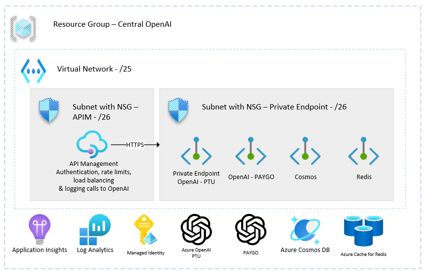

# apim-aoai-terraform-lz



## Disclaimer

**THE SOFTWARE IS PROVIDED "AS IS", WITHOUT WARRANTY OF ANY KIND, EXPRESS OR IMPLIED, INCLUDING BUT NOT LIMITED TO THE WARRANTIES OF MERCHANTABILITY, FITNESS FOR A PARTICULAR PURPOSE AND NONINFRINGEMENT. IN NO EVENT SHALL THE AUTHORS OR COPYRIGHT HOLDERS BE LIABLE FOR ANY CLAIM, DAMAGES OR OTHER LIABILITY, WHETHER IN AN ACTION OF CONTRACT, TORT OR OTHERWISE, ARISING FROM, OUT OF OR IN CONNECTION WITH THE SOFTWARE OR THE USE OR OTHER DEALINGS IN THE SOFTWARE.**

## Prerequisites

- [Azure CLI](https://docs.microsoft.com/en-us/cli/azure/install-azure-cli)
- Azure subscription & resource group

## Deployment

1. Update the `infra/provider.conf.json` file with where you intend to store the Terraform state file.
1. Update the `infra/main.tfvars.json` file with specifics of your environment.
1. Run the following command to initialize Terraform

    ```shell
    terraform init -backend-config ./provider.conf.json
    ```

1. Run the following command to plan your Terraform deployment

    ```shell
    terraform plan -var-file="./main.tfvars.json"
    ```

1. Run the following command to apply your Terraform deployment

    ```shell
    terraform apply -var-file "./main.tfvars.json"
    ```

## Links
